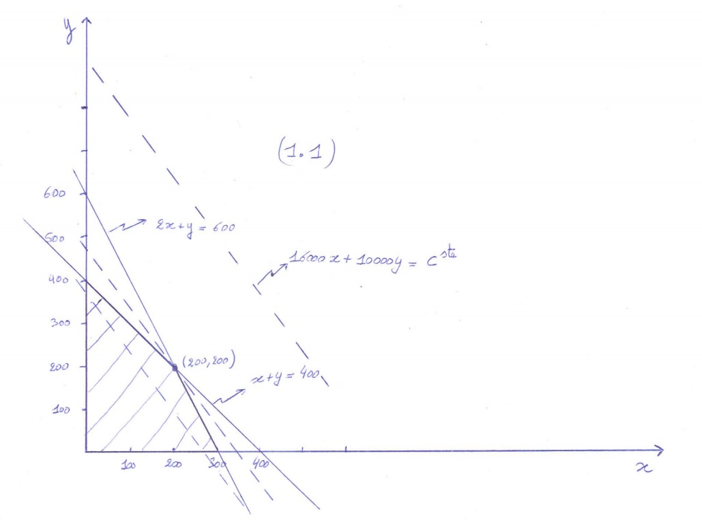
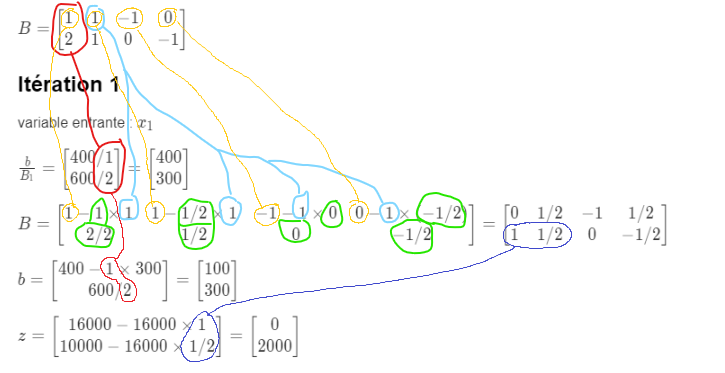

# Optimisation linéaire

[Retour](index.html)

## Problème primal

### Enoncé du problème
minimisation :
$min\ zx\ s.t.$
$Ax \ge b$

maximisation :
$max\ zx\ s.t.$
$Ax \le b$

#### Notation matricielle

Ici, on utilisera des matrices pour noter les équations. Cela nous permettra de définir des formules de résolution.
Par exemple si on a :
$A = \begin{bmatrix}
   1 & 1 \\
   2 & 1
\end{bmatrix}$ , $x = \{x_1, x2\}$ et $b = \{400, 600\}$
alors $Ax \le b$ vaudra :
$x_1 + x_2 \le 400$
$2x_1  + x_2 \le 600$

#### Exemple
On considère le cas d’un fabricant d’automobiles qui propose deux modèles à la vente, des grosses voitures et des petites voitures. Les voitures de ce fabriquant sont tellement à la mode qu’il est certain de vendre tout ce qu’il parvient à produire, au moins au prix catalogue actuel de 16000 euros pour les grosses voitures, et 10000 euros pour les petites voitures. Son problème vient de l’approvisionnement limité en deux matières premières, le caoutchouc et l’acier. La construction d’une petite voiture nécessite l’emploi d’une unité de caoutchouc et d’une unité d’acier, tandis que celle d’une grosse voiture nécessite une unité de caoutchouc mais deux unités d’acier. Sachant que son stock de caoutchouc est de 400 unités et son stock d’acier de 600 unités, combien doit-il produire de petites et de grosses voitures au moyen de ces stocks afin de maximiser son chiffre d’affaire ? Nous appellerons x le nombre de grosses voitures produites, y le nombre de petites voitures produites, et z le chiffre d’affaire résultant.

Le problème se traduit alors sous la forme :

$max\ 16000x_1 + 10000x_2\ s.t.$
$x_1 + x_2 \le 400$
$2x_1  + x_2 \le 600$
$x_1 \ge 0, x_2 \ge 0$

Pour ce problème de maximisation, on a :
$x = \{x_1, x_2\}$
$z = \{16000, 10000\}$
$A = \begin{bmatrix}
   1 & 1 \\
   2 & 1
\end{bmatrix}$
$b = \{400, 600\}$

On peut le résoudre graphiquement comme cela :

On devrait donc trouver une solution $x_1 = 200, x_2 = 200$

### Variables hors base
On commence par définir une matrice de résolution $B$ :
$B = [A; -I]$
Cette matrice contient les coefficients de nos variables de base, plus des variables hors base qui seront rajoutées. Ces variables représentent le manque à gagner sur chaque contrainte.
Cette matrice a la propriété suivante :
$B\begin{bmatrix}
  x_1 \\
  x_2 \\
  x_3 \\
  x_4
\end{bmatrix} = 0$ avec $x_3$ et $x_4$ les variables hors base
Ainsi, si un élément est égal à $-1$, on peut en déduire qu'il est égal à la somme des autres.

#### Exemple
Pour le même exemple :
$B = \begin{bmatrix}
  1 & 1 & -1 & 0 \\
  2 & 1 & 0 & -1
\end{bmatrix}$

On peut en déduire :
$x_3 = x_1 + x_2$
$x_4 = 2x_1 + x_2$

### Choix de la variables entrante
Pour éviter les cycles, on va choisir $x_i$ comme variable entrante dans l'ordre des $i$. On ne peut faire rentrer une variable seulement si elle contribue à améliorer la fonction objectif $zx$.

#### Exemple
Pour notre exemple, la première variable entrante sera $x_1$.

### Choix de la variable sortante
On va voir quelle variable sortante est la plus contraignante pour la variable entrante. Pour cela, on compare les éléments de $\frac{b}{B_i}$ avec $x_i$ comme variable entrante
On va donc choisir la variable sortante correspondant à la ligne qui maximum pour un problème de minimisation et insversement.
Par exemple pour un problème de minimisation on aura des contraintes de supériorité :
$x_i \ge max(\frac{b}{B_i})$

#### Exemple
Notre variable entrante est $x_1$, le premier élément de $x$. On va donc comparer les contraintes en divisant $b$ par $B_1$ :

$\frac{b}{B_1} = \begin{bmatrix}
  400/1 \\
  600/2
\end{bmatrix} = \begin{bmatrix}
  400 \\
  300
\end{bmatrix}$

Puisqu'il s'agit d'un problème de maximisation, on a des contraintes d'infériorité :
$x_1 \le 400$ pour $x_3$ et
$x_1 \le 300$ pour $x_4$

On va prendre le minimum de la dernière colonne : $300$
Il s'agit donc de la deuxième ligne, on va donc prendre la deuxième variable sortante : $x_4$

### Echange de variables

Pour mettre à jour $B$, on va commencer par calculer la ligne correspondant à notre variable sortante $x_j$ pour mettre le coefficient de la variable entrante $x_i$ à $-1$. On pourra donc exprimer la contrainte comme la valeur de $x_i$.
$B_{\cdot j} = \frac{B_{\cdot j}}{-B_{ij}}$

On pourra ensuite mettre à jour les autres lignes $B_{\cdot k}$ en remplaçant la valeur de $x_i$ par $B_{\cdot j}$. Cela se traduit par soustraire $B_{\cdot j}$ multiplié par le coefficient de $x_i$ dans la contrainte :
$B_{\cdot k} = B_{\cdot k} - B_{ik} B_{\cdot j}$ avec $k \neq j$

Il faudra aussi mettre à jour $b$ avec la même manipulation :
$b_j = \frac{b_j}{-B_{ij}}$
$b_k = b_k - B_{ik} b_j$ toujours avec $k \neq j$

#### Exemple

On adapte la ligne correspondant à $x_4$ pour coller avec $x_1$ :
$-B_{ij} = -B_{12} = 2$
$B_{\cdot j} = \frac{B_{\cdot j}}{-B_{ij}} =\frac{\begin{bmatrix}
  2 & 1 & 0 & -1
\end{bmatrix}}{2} = \begin{bmatrix}
  1 & 1/2 & 0 & -1/2
\end{bmatrix}$

On adapte la ligne restante :
$B_{\cdot k} - B_{ik} B_{\cdot j}$ avec $B_{ik} = B_{11} = 1$
$B = \begin{bmatrix}
  1-1 \times 1 & 1 - 1 \times 1/2 & -1 - 1 \times 0 & 0 - 1 \times (-1/2) \\
  1 & 1/2 & 0 & -1/2
\end{bmatrix} = \begin{bmatrix}
  0 & 1/2 & -1 & 1/2 \\
  1 & 1/2 & 0 & -1/2
\end{bmatrix}$

On met à jour $b$ :
$b = \begin{bmatrix}
  400 - 1 \times 300 \\
  600 / 2
\end{bmatrix} = \begin{bmatrix}
  100 \\
  300
\end{bmatrix}$

### Nouvelle fonction objectif

On a assigné une valeur à la variable entrante $x_i$. On peut ainsi remplacer cette variable par sa valeur dans la fonction objectif :
$z = z - z_iB_{kj}$ avec $k \le 2$

#### Exemple

$z = \begin{bmatrix}
  16000 - 16000 \times 1 \\
  10000 - 16000 \times 1/2
\end{bmatrix} = \begin{bmatrix}
  0 \\
  2000
\end{bmatrix}$

### Fin
Une itération se résume donc ainsi :

On va itérer ces opérations jusqu'à obtenir notre solution, c'est à dire jusqu'à que tous les éléments de z soient positifs s'il s'agit d'un problème de minimisation et insversement. Vous pouvez voir l'exemple complet [ici](primal-exemple.html) mais je vous invite à essayer de le finir vous même 😉
